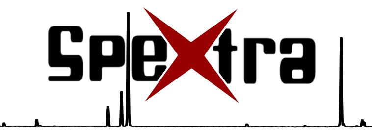
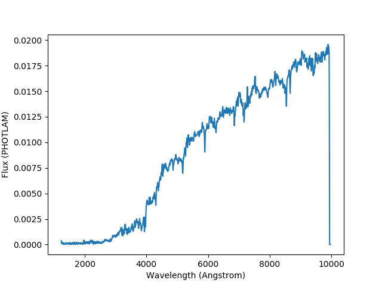

=======
SpeXtra
=======

.. image:: https://travis-ci.org/miguelverdugo/speXtra.svg?branch=master
    :target: https://travis-ci.org/github/miguelverdugo/speXtra
    :alt: Tests Status

.. image:: https://readthedocs.org/projects/spextra/badge/?version=latest
    :target: https://spextra.readthedocs.io/en/latest/?badge=latest
    :alt: Documentation Status

A python tool to manage and manipulate astronomical spectra

Description
===========

``speXtra`` is a python tool to download, load, display and manipulate spectra of astronomical sources.
It has developed to provide spectral sources to ScopeSim_ but it may be helpful for other purposes too.

.. _ScopeSim: https://scopesim.readthedocs.io/en/latest/?badge=latest

speXtra stands in the shoulder of giants: synphot_ and astropy_

.. _synphot: https://synphot.readthedocs.io/en/latest/

.. _astropy: https://www.astropy.org/

To install ``spextra`` just type:

.. code-block:: bash

    pip install spextra

Soon a PyPi version will be available

Functionalities
===============

``speXtra`` is able to:

- Download spectra from a database and return it in format compatible with ``synphot`` format

.. code-block:: python

    from spextra import Spextrum
    sp = Spextrum("kc96/s0")

and it will load the S0 galaxy template of the Kinney-Calzetti spectral library. To quickly
plot the resulting spectra, simply type

.. code-block:: python

    sp.plot()

